# StandardRobot++

## 简介
本项目的计划是基于 DJI StandardRobot 的基础上改造成一个更适合北极熊uu们的通用型机器人代码框架

主要内容框架如下：


## 开发进度
- 校准
  - [ ] 云台校准
  - [ ] 陀螺仪校准
  - [ ] 底盘校准
- 底盘类型
  - [ ] 麦轮底盘
  - [ ] 全向轮底盘
  - [ ] 舵轮底盘
  - [x] 平衡底盘
- 底盘模式
  - [ ] 云台跟随
  - [ ] 独立于云台运动
  - [ ] 小陀螺
- 云台模式
  - [ ] 陀螺仪绝对角度控制
  - [ ] 电机编码角相对角度控制
- 射击模式
  - [ ] 单发
  - [ ] 连发

## 如何使用本框架

在 [robot_param.h](./application/robot_param.h) 中填写机器人参数

**通用参数：**
```C
// 可用底盘类型
#define CHASSIS_MECANUM_WHEEL 0  // 麦克纳姆轮底盘
#define CHASSIS_OMNI_WHEEL 1     // 全向轮底盘
#define CHASSIS_STEERING_WHEEL 2 // 舵轮底盘
#define CHASSIS_BALANCE 3        // 平衡底盘

// 控制类型（板间通信时用到）
#define CHASSIS_ONLY 0       // 只控制底盘
#define GIMBAL_ONLY 1        // 只控制云台
#define CHASSIS_AND_GIMBAL 2 // 控制底盘和云台

#define __DEBUG 0                       // 调试模式
#define CHASSIS_TYPE CHASSIS_BALANCE    // 选择底盘类型
#define CONTROL_TYPE CHASSIS_AND_GIMBAL // 选择控制类型
#define GUN_NUM 1                       // 定义枪管个数（一个枪管2个摩擦轮）
#define BULLET_NUM 8                    // 定义拨弹盘容纳弹丸个数
#define FRIC_RADIUS 0.03f               // (m)摩擦轮半径
```
## 遥控器的使用
1. 左拨杆控制开火
2. 右拨杆控制底盘模式
3. 左摇杆控制云台
4. 右摇杆控制底盘（运动方向以云台方向为前方）
5. 左上滑片控制旋转速度

## 文档链接
- [应用层](./application/README.md)