# 底盘介绍
## 硬件规范
### CAN线
- **平衡底盘**

  若使用

- **全向轮、麦轮底盘**

  若使用 **GM3508** 作为驱动轮，统一接入`CAN1`，并使用 `0x200` 标识符作为底盘数据包的标识符

### 电机
统一以逆时针旋转为正方向。

### 电机ID与正方向
- **平衡底盘**
  
  
  
  以正方向为对称轴
  - 左边前关节ID为1，后关节ID为2；右边前关节ID为3，后关节ID为4。
  - 左驱动轮ID为1，右驱动轮ID为2

- **全向轮、麦轮底盘**

  逆时针方向增大，ID为1和4的电机中间为...

### 遥控器使用
- **平衡底盘**
  - 左拨杆：未使用
  - 右拨杆：底盘模式切换。
    - 上档：正常控制，跟随云台
    - 中档：正常控制，自由底盘
    - 下档：底盘无力，紧急停止
  - 左摇杆：未使用
  - 右摇杆：控制x和y方向上的平移速度
  - 左滚轮：小陀螺旋转速度

- **全向轮、麦轮底盘**
  - 左拨杆：未使用
  - 右拨杆：底盘模式切换。
    - 上档： 
    - 中档：
    - 下档：
  - 左摇杆：未使用
  - 右摇杆：控制x和y方向上的平移速度
  - 左滚轮：小陀螺旋转速度

### 键鼠操作
- **平衡底盘**
  - W: 前进
  - A: 左平移
  - S: 后退
  - D: 右平移
  - Q: 左探头
  - E: 右探头
  - 空格: 跳跃

- **全向轮、麦轮底盘**
  - W: 
