# 底盘介绍

## 框架
### 主体框图


### 主代码框架
- 主体框架由以下几部分构成：
  1. 初始化
  2. 模式设置
  3. 状态反馈
  4. 目标值设置
  5. 控制量计算
  6. 直接控制量发送

    每个部分从对应的`/*----*/`注释开始\
    每个部分内部可视为一个小文件。该部分的函数声明全部置于`/*----*/`注释以下。

```C
static Chassis_s CHASSIS = {...};

/*-------------------- Init --------------------*/

/**
 * @brief          初始化
 * @param[in]      none
 * @retval         none
 */
void InitChassis(void)
{
    add code here
}

/*-------------------- Set mode --------------------*/

/**
 * @brief          设置模式
 * @param[in]      none
 * @retval         none
 */
void SetChassisMode(void)
{
    add code here
}

/*-------------------- Observe --------------------*/

/**
 * @brief          更新状态量
 * @param[in]      none
 * @retval         none
 */
void ChassisObserver(void)
{
    add code here
}

/*-------------------- Reference --------------------*/

/**
 * @brief          更新目标量
 * @param[in]      none
 * @retval         none
 */
void ChassisReference(void)
{
    add code here
}

/*-------------------- Console --------------------*/

/**
 * @brief          计算控制量
 * @param[in]      none
 * @retval         none
 */
void ChassisConsole(void)
{
    add code here
}

/*-------------------- Cmd --------------------*/

/**
 * @brief          发送控制量
 * @param[in]      none
 * @retval         none
 */
void SendChassisCmd(void)
{
    add code here
}
```